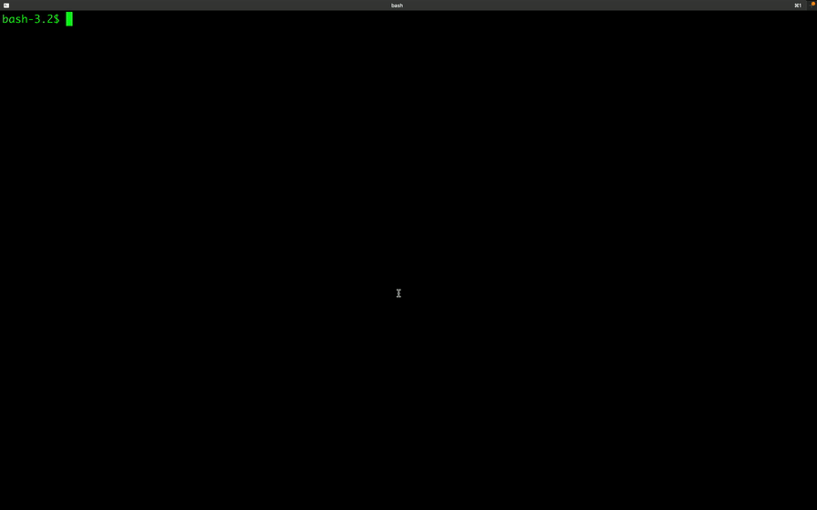

## Step by step for  using TFTools with docker

> This tutorial assumes that users have docker installed and able to access `docker` from their command line.



(Optional) Creating a temporary directory

```bash
$ mkdir /tmp/tftools
$ cd /tmp/tftools
```

For testing `tftools`, lets use following example from https://registry.terraform.io/providers/hashicorp/google/latest/docs/resources/storage_bucket

```bash
$ cat main.tf
resource "google_storage_bucket" "static-site" {
  name          = "image-store.com"
  location      = "EU"
  force_destroy = true

  uniform_bucket_level_access = true

  website {
    main_page_suffix = "index.html"
    not_found_page   = "404.html"
  }
  cors {
    origin          = ["http://image-store.com"]
    method          = ["GET", "HEAD", "PUT", "POST", "DELETE"]
    response_header = ["*"]
    max_age_seconds = 3600
  }
}
```

Fetching docker instance from DockerHub
```bash
$ docker pull msampathkumar/tftools
Using default tag: latest
latest: Pulling from msampathkumar/tftools
Digest: sha256:d2e7cb0b26991ef729a259de41879f53d8a6cfd028038878e3beba9f04f742f2
Status: Image is up to date for msampathkumar/tftools:latest
docker.io/msampathkumar/tftools:latest
```

Running `tftools` docker with current working directory mounted as `/app`. To exit the docker instance, use `exit` command.

```bash
$ docker run --rm -it -v ${PWD}:/app msampathkumar/tftools

/app # tftools main.tf
Running:/usr/bin/tftools main.tf
=================================== [tftools] ===================================
Running - convert2erb
Running - convert2erb - ANTLR4 Parser
Running - convert2erb - TF File checks
Terraform Resources Summary
--------------------------------------------------------------------------------------------------------------
 ID	ResourceType                                     TFLocalName                            ResourceName
  1.	google_storage_bucket                            static-site                         image-store.com
--------------------------------------------------------------------------------------------------------------
From the above table, enter a Primary Resource row ID: 1
ResourceType	: google_storage_bucket
TFLocalName	: static-site
ResourceName	: image-store.com
Enter `yes` to proceed: yes
 -> Output Written to terraform.yaml_check
 -> Output Written to main.tf.erb_check
=================================== [tftools] ===================================

/app # ls -la
total 16
drwxr-xr-x    5 root     root           160 Aug 25 16:44 .
drwxr-xr-x    1 root     root          4096 Aug 25 16:43 ..
-rw-r--r--    1 root     root           438 Aug 25 16:37 main.tf
-rw-r--r--    1 root     root           480 Aug 25 16:44 main.tf.erb_check
-rw-r--r--    1 root     root           502 Aug 25 16:44 terraform.yaml_check
/app # exit
```

Checking output files
```bash
$ ls
main.tf			main.tf.erb_check	terraform.yaml_check
$ cat main.tf.erb_check
resource "google_storage_bucket" "<%= ctx[:primary_resource_id] %>" {
  name          = "<%= ctx[:vars]['image_store.com'] %>"
  location      = "EU"
  force_destroy = true

  uniform_bucket_level_access = true

  website {
    main_page_suffix = "index.html"
    not_found_page   = "404.html"
  }
  cors {
    origin          = ["http://image-store.com"]
    method          = ["GET", "HEAD", "PUT", "POST", "DELETE"]
    response_header = ["*"]
    max_age_seconds = 3600
  }
}
```
